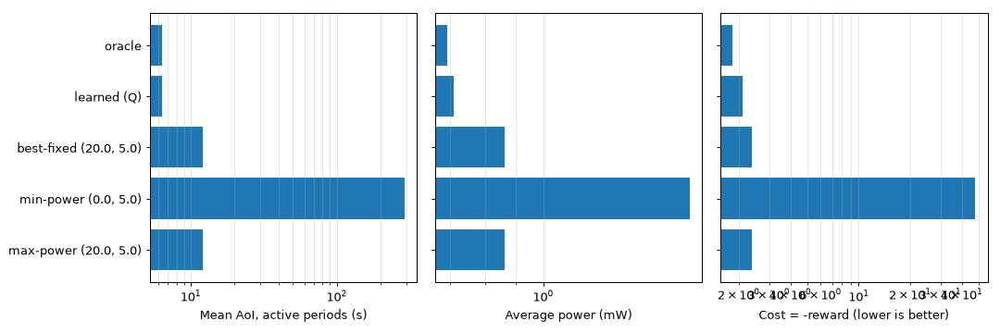

# Fresh, energy-aware Wi-Fi HaLow (802.11ah) for IoT

[](https://github.com/sandeepsudula/aoi-twt-halow/actions/workflows/run.yml)

How should battery-powered 802.11ah stations sleep and transmit so that the data at the access point stays
**fresh** (low Age of Information, AoI) on a tight energy budget? This repo holds one research arc in three
parts, built around a Morse Micro **MM6108** HaLow testbed (EKH01 gateway, EKH05 nodes):

| Order | Project | Folder | Status |
|---|---|---|---|
| 1st | **HaLow measurement study** — range, link quality, MCS, latency, per-node energy | `measure/` | toolkit ready, awaiting testbed data |
| 2nd | **AoI-aware TWT** (main contribution) — TWT schedules that minimize AoI under an energy budget, with event-driven adaptation | `aoitwt/`, `experiments/` | prototype + first results |
| 3rd | **Joint TX-power + TWT controller, sim-to-real** — learned in simulation, run on the real gateway | `control/` | prototype + first results |

The measurement study comes first because it gives the other two their real numbers. Until then, the
simulators use **published values** — MM6108 module and STM32U585 data sheets, the 802.11ah MCS table and the
TGah path-loss model — listed with sources in [docs/parameters.md](docs/parameters.md). The results below are
simulation results with those parameters, **not testbed measurements**.

## 1 · Measurement study (`measure/`, [docs/measurement_study.md](docs/measurement_study.md))

- `collect.py` — one command per position: `ping` (RTT, loss), `iperf3` (throughput), and the gateway's
  `iw station dump` (signal, bitrate, retries) appended to a CSV with scenario metadata.
- `parse_power.py` — turns a power-analyzer current trace into sleep/listen/transmit power, transmit time,
  energy per wake and wake interval: exactly the values `aoitwt/params.py` needs.
- `analyze.py` — summary table and signal / loss / RTT / throughput vs distance per scenario.

## 2 · AoI-aware TWT (`aoitwt/`, `experiments/`)

Each station senses a calm/active environment; AoI during active periods is weighted 10×. Policies:
**fixed** TWT interval (smallest that fits the budget), **adaptive** (`T_slow`/`T_fast` with TWT
renegotiation charged), **adaptive + event wake** (always-on local sensing triggers an immediate,
contended wake), and **legacy power save** for reference.


- At the **same average power**, adaptive TWT cuts mean AoI during active periods by **~34–49 %**
  (e.g. 5.53 s → 3.00 s at 0.5 mW; the smallest gain is at the tightest 0.15 mW budget) and state-weighted
  AoI by ~9–16 %; overall time-averaged AoI rises slightly (by ~4–6 %), because calm periods get longer sleeps.
- Event wake cuts onset-to-delivery latency from seconds (mean 5.8 s at 0.5 mW) to well under a second (median ~9 ms; mean 0.05 s at 0.5 mW, 0.28 s at 0.15 mW) — an
  upper bound that assumes an idle channel and ideal sensing, to be checked in ns-3 and on hardware.
- Individual TWT vs legacy PS (60 s reporting): ~38 % less power per station with random phases, ~93 % less
  at 200 synchronized stations. More: `results/e2_*`, `results/e3_*`, [docs/plan.md](docs/plan.md).

## 3 · Joint power + TWT controller (`control/`, [docs/control.md](docs/control.md))

A gateway-side controller picks TX power and TWT interval per node from what the gateway can observe
(signal bucket, calm/active). Trained in a link/energy/AoI simulator; `deploy/gateway_agent.py` runs the
learned table on OpenWrt and sends UDP commands to nodes.



- Versus the best fixed (power, interval) pair (20 dBm, 5 s), the learned controller lowers active-period
  AoI from ~12.0 s to ~6.4 s **and** average power from ~0.86 to ~0.71 mW (reward 12 % better); an SNR-aware
  oracle is still 14 % better than the learned policy. The learned policy sleeps longer in calm periods, so its
  overall average AoI is higher (10.2 s vs 8.2 s).

## Run it

```bash
pip install -r requirements.txt
python -m pytest -q tests          # analytic and unit checks
python -m experiments.run_all      # AoI-aware TWT experiments (~3 min)
python -m control.train            # train + compare power/TWT controllers (~10 s)
```

Every push runs all of this on GitHub Actions and commits refreshed figures to `results/`.

## Layout

```
measure/                 collect.py, parse_power.py, analyze.py
aoitwt/                  params.py (data-sheet values), sim.py (TWT/AoI/energy model)
experiments/run_all.py   E1 AoI vs budget, E2 detection latency, E3 legacy vs TWT
control/                 env.py, agent.py, train.py, deploy/gateway_agent.py
tests/                   test_sanity.py, test_measure.py, test_control.py
docs/                    parameters & sources, plan, measurement study, testbed, ns-3 notes, controller
```

## Related work in the lab

This builds on ideas from the TXST SHINe Lab, in particular Maksud Ahmed's ns-3 work on 802.11ax TWT
scheduling ([802.11ax-DRL-TWT-ICCCN26](https://github.com/ahmedmaksud/802.11ax-DRL-TWT-ICCCN26)) and ns3-ai
transmission control ([NS3-first-WiFi-test](https://github.com/ahmedmaksud/NS3-first-WiFi-test)), and the
lab's HaLow hardware ([TXST-SHINe-Lab/Wifi-Halow](https://github.com/TXST-SHINe-Lab/Wifi-Halow)).
The AoI formulation, the 802.11ah focus, the event-driven and joint-control policies, the measurement
toolkit and the code here are separate from that work.
