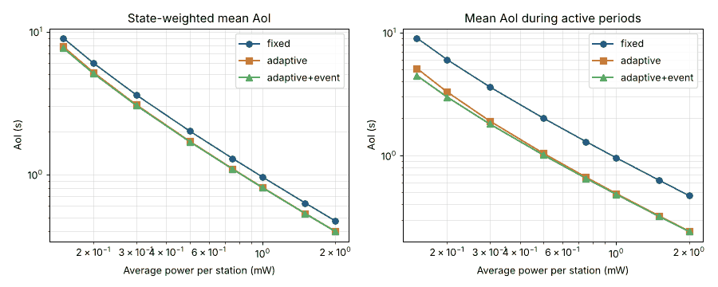

# AoI-aware Target Wake Time for 802.11ah (Wi-Fi HaLow)

Energy-efficient IoT stations usually tune Target Wake Time (TWT) for **energy vs. throughput**.
For monitoring, what matters is how **fresh** the data at the AP is — its **Age of Information (AoI)** —
and freshness matters much more at some moments (an anomaly, an alarm) than others.

This project designs TWT schedules that **minimize state-weighted AoI under a per-station energy budget**
for 802.11ah stations, with **event-driven adaptation** (a station shortens its wake interval when it
observes something worth reporting), and validates them on a **Morse Micro MM6108 HaLow testbed**.

## Status

| Phase | What | State |
|---|---|---|
| 0 | Python prototype simulator (this repo) | ✅ working, first results |
| 1 | Testbed baseline: measure MM6108 power states, timing, TWT support | ⏳ next — [docs/testbed.md](docs/testbed.md) |
| 2 | ns-3 model with 802.11ah PHY/MAC | ⏳ — [docs/ns3.md](docs/ns3.md) |
| 3 | Validate the best policies on hardware | ⏳ |

Full plan and milestones: [docs/plan.md](docs/plan.md).

## Prototype model (phase 0)

- Each station senses a two-state environment (**calm** / **active**, CTMC; default mean 30 min calm, 2 min active).
  AoI during active periods is weighted 10× by default.
- Generate-at-will uplink updates; individual TWT with SPs staggered by the AP (no contention);
  legacy power-save stations contend after the beacon.
- Policies:
  - **fixed** — one TWT interval, the smallest that fits the energy budget (closed form).
  - **adaptive** — `T_slow` / `T_fast`; switch to fast (TWT renegotiation, energy charged) when a wake observes *active*,
    back to slow after `k` calm wakes. `T_slow` is tuned by bisection so the policy meets the **same** budget.
  - **adaptive + event wake** — always-on local sensing triggers an unscheduled, contended wake at the onset of *active*.
  - **legacy PS** — beacon listening every listen interval plus beacon-aligned uplink with contention.

> ⚠️ All radio power/timing values in `aoitwt/params.py` are **placeholders**. They will be replaced with
> values measured on the MM6108 testbed (phase 1) before any result is reported.

## First results (placeholder radio parameters, 5 × 24 h runs per point)



- At the **same average power**, adaptive TWT cuts mean AoI **during active periods by ~43–50 %**
  vs. the budget-optimal fixed interval (e.g. 2.01 s → 1.04 s at 0.5 mW), and state-weighted AoI by ~15 %.
- Event wake brings onset-to-delivery latency from seconds (mean 2.0 s at 0.5 mW) to ~10 ms — but that number
  assumes an idle channel and ideal local sensing; it is an upper bound on the benefit, to be checked in ns-3 and on hardware.
- Legacy PS vs. individual TWT (60 s reporting): TWT uses ~29 % less power per station with random phases,
  and ~90 % less at 200 stations when legacy stations report synchronously and contend.

Raw numbers: `results/*.csv`.

## Run it

```bash
pip install -r requirements.txt
python -m pytest -q tests          # sanity checks (AoI = T/2 + d, budgets met)
python -m experiments.run_all      # ~2–3 min, writes results/
```

## Layout

```
aoitwt/params.py        radio, environment, simulation parameters
aoitwt/sim.py           event model, policies, energy + AoI accounting
experiments/run_all.py  E1 AoI vs budget, E2 detection-latency CDF, E3 legacy vs TWT
tests/                  analytic sanity checks
docs/                   plan, testbed procedure, ns-3 notes
```

## Related work in the lab

This project builds on ideas from the TXST SHINe Lab, in particular Maksud Ahmed's ns-3 work on
802.11ax TWT scheduling ([802.11ax-DRL-TWT-ICCCN26](https://github.com/ahmedmaksud/802.11ax-DRL-TWT-ICCCN26))
and the lab's HaLow hardware ([TXST-SHINe-Lab/Wifi-Halow](https://github.com/TXST-SHINe-Lab/Wifi-Halow)).
The AoI formulation, 802.11ah focus, event-driven policy and code here are separate from that work.
